<div align="center">

# 🏆 Ultimate Fantasy Legends
### *Scottish Premiership Fantasy Football Platform*

**Trabajo de Fin de Grado** — Abdul Hakim Byaz Iglesias · [GitHub](https://github.com/Abdul222002)

---

[](https://github.com/Abdul222002)
[](https://fastapi.tiangolo.com)
[](https://react.dev)
[](https://docker.com)
[](https://mysql.com)
[](https://python.org)

*Plataforma de fantasy football con mecánicas de mercado, simulación PvP y datos reales de la Scottish Premiership*

</div>

---

## 📋 Índice

| Sección | Sección |
|---|---|
| [🧭 Resumen Ejecutivo](#-resumen-ejecutivo) | [🗃️ Modelo de Datos](#️-modelo-de-datos) |
| [🚶 Flujo de Uso](#-flujo-de-uso) | [🎯 Motor de Puntuación](#-motor-de-puntuación) |
| [👥 Roles y Permisos](#-roles-y-permisos-de-usuario) | [💰 Ingeniería Económica](#-ingeniería-económica) |
| [🏗️ Arquitectura del Sistema](#️-arquitectura-del-sistema) | [⚔️ Arena PvP](#️-arena-pvp) |
| [🛠️ Stack Tecnológico](#️-stack-tecnológico-y-justificación) | [📁 Estructura del Proyecto](#-estructura-del-proyecto) |
| [✨ Funcionalidades Principales](#-funcionalidades-principales) | [📡 API Reference](#-api-reference) |
| [🚀 Instalación y Despliegue](#-instalación-y-despliegue) | [🔮 Trabajo Futuro](#-trabajo-futuro) |

---

## 🧭 Resumen Ejecutivo

**Ultimate Fantasy Legends (UFL)** es una plataforma de fantasy football basada en la **Scottish Premiership** (la primera división del fútbol escocés, con 12 equipos y 33 jornadas por temporada) que va mucho más allá de las aplicaciones tradicionales de fantasy. Mientras que plataformas como Fantasy Premier League se limitan a asignar puntos según el rendimiento real y mostrar una clasificación, UFL crea un **ecosistema completo de gestión deportiva** que integra economía virtual, mercado de fichajes, combate entre usuarios y datos en tiempo real.

El proyecto ha sido desarrollado como **Trabajo de Fin de Grado** y demuestra la aplicación práctica de conceptos de ingeniería de software: arquitectura de microservicios, diseño de APIs RESTful, gestión de bases de datos relacionales con transacciones ACID, integración con APIs externas, scheduling de tareas asíncronas y desarrollo de interfaces de usuario interactivas.

En lo que se basa la apliccacion es en que el ususaio use su habilidad de gestión de recursos (monedas) y estrategia de alineación para competir contra otros usuarios en ligas privadas, con la emoción añadida de un mercado activo y la posibilidad de enfrentarse directamente en una Arena PvP. La integración con datos reales de la Scottish Premiership a través de Sportmonks API garantiza que cada gol, asistencia o tarjeta tenga un impacto tangible en el rendimiento fantasy, creando una experiencia inmersiva y dinámica.

### ❓ El Problema que Resuelve

| Problema en fantasy tradicional | Solución en UFL |
|---|---|
| **Pasividad** — el usuario elige equipo una vez por jornada y espera sin interacción | Mercado activo 24/7 con subastas diarias, ventas entre usuarios y clausulazos que mantienen la tensión constante |
| **Sin estrategia financiera** — presupuesto fijo sin consecuencias a largo plazo | Sistema económico dinámico: cada compra, blindaje o venta afecta tu capacidad futura de operar en el mercado |
| **Competición limitada** — solo clasificación dentro de tu liga | Arena PvP con ranking ELO global que enfrenta a cualquier usuario contra cualquier otro |
| **Desconexión de la realidad** — puntos arbitrarios sin vínculo con el fútbol real | Integración con **Sportmonks API**: goles, asistencias, tarjetas y más de 25 métricas reales → puntos fantasy |

---

### 🏛️ Los Tres Pilares de UFL

<table>
<tr>
<td align="center" width="33%">

**🔄 Pilar 1**
### Mercado Cíclico

Cada liga tiene un mercado de subastas que se renueva **cada 24 horas** con 12 jugadores aleatorios. Precios estables y pujas ciegas: el foco está en la **teoría de juegos** y la gestión de recursos.

</td>
<td align="center" width="33%">

**⚔️ Pilar 2**
### Arena PvP con ELO

Simula enfrentamientos contra equipos de cualquier usuario. El algoritmo compara líneas, aplica sinergias y genera un resultado. Cada batalla afecta al **ranking ELO global**.

</td>
<td align="center" width="33%">

**📊 Pilar 3**
### Datos en Tiempo Real

Integración con **Sportmonks API** para ingestar goles, asistencias, tarjetas, paradas y más de 25 métricas de cada partido de la Scottish Premiership.

</td>
</tr>
</table>

### ⚙️ Tecnologías Clave

Arquitectura de **microservicios dockerizada** con tres contenedores:

```
Frontend  → React 18 + Vite + Nginx          (puerto 3000)
Backend   → FastAPI + Uvicorn + APScheduler  (puerto 8000)
Database  → MySQL 8.0                        (puerto 3306)
```

> El **scheduler** es el corazón del sistema: resuelve subastas expiradas, genera nuevas subastas cíclicas, calcula puntos de jornadas, crea ofertas automáticas y sincroniza con Sportmonks — todo sin intervención humana.

---

## 🚶 Flujo de Uso

> Recorrido completo desde el registro hasta la competición en liga, paso a paso.

```
┌─────────────┐
│  1. Registro │  Creas tu cuenta con email y contraseña. Recibes un OTP de 6 dígitos
│             │  por email que debes verificar para activar la cuenta.
└──────┬──────┘
       ▼
┌──────────────────┐
│ 2. Crear / Unirse│  Creas una liga privada con nombre y código de invitación,
│    a una Liga    │  o aceptas una invitación recibida por email o username.
└──────┬───────────┘
       ▼
┌──────────────────┐
│ 3. Equipo Inicial│  El sistema asigna automáticamente 15 jugadores aleatorios
│   (15 jugadores) │  de la Scottish Premiership (todas las posiciones cubiertas)
│                  │  + 100.000.000 monedas iniciales para operar en el mercado.
└──────┬───────────┘
       ▼
┌──────────────────┐
│ 4. Personalizar  │  Cambias el nombre de tu equipo, eliges un escudo (30+ presets
│    tu Equipo     │  o URL propia) y seleccionas el color del kit.
└──────┬───────────┘
       ▼
┌──────────────────┐
│ 5. Formación     │  Eliges 11 de 15 jugadores + formación táctica (4-4-2, 4-3-3...)
│   por Jornada    │  antes de cada jornada. Deadline = inicio del primer partido.
└──────┬───────────┘
       ▼
┌──────────────────┐
│ 6. Partidos      │  Los partidos reales de la SPFL se juegan (33 jornadas × 6 partidos).
│    Reales        │  Los resultados se ingestan automáticamente vía Sportmonks API.
└──────┬───────────┘
       ▼
┌──────────────────┐
│ 7. Puntos Fantasy│  Stats reales → motor de puntuación → puntos según posición
│                  │  (goles, asistencias, porterías a cero, tackles, etc.)
└──────┬───────────┘
       ▼
┌──────────────────────────────────────────────────────────────┐
│  8. Monedas    →    1 punto = 100.000 monedas                │
│                                                              │
│   ┌──────────────┐  ┌──────────────┐  ┌──────────────┐      │
│   │  💸 Mercado  │  │  ⚔️  Arena   │  │  📦 Sobres   │      │
│   │  Subastas    │  │    PvP       │  │   de Iconos  │      │
│   │  + Ventas    │  │  (5 tickets) │  │  (150M/sobre)│      │
│   └──────────────┘  └──────────────┘  └──────────────┘      │
└──────────────────────────────────────────────────────────────┘
       ▼
┌──────────────────┐
│ 9. Clasificación │  Ranking de la liga por puntos totales acumulados
│   de la Liga     │  a lo largo de las 33 jornadas. ¡El mayor gana!
└──────────────────┘
```

### 📐 Tabla de Puntuación Rápida

| Acción | ⚽ Delantero | 🟢 Centrocampista | 🔵 Defensa | 🧤 Portero |
|:---:|:---:|:---:|:---:|:---:|
| Gol | +4 | +5 | +6 | +6 |
| Asistencia | +3 | +3 | +3 | +3 |
| Portería a cero | — | +1 | +4 | +4 |
| Tarjeta amarilla | -1 | -1 | -1 | -1 |
| Tarjeta roja | -3 | -3 | -3 | -3 |
| Gol en contra | -2 | -2 | -2 | -2 |

---

## 👥 Roles y Permisos de Usuario

El sistema cuenta con **dos niveles de acceso**:

| Funcionalidad | 👤 FREE | 🔑 ADMIN |
|---|:---:|:---:|
| Crear / Unirse a Ligas | ✅ | ✅ |
| Gestión de Equipo y Formaciones | ✅ | ✅ |
| Mercado de Subastas (24h) | ✅ | ✅ |
| Compra / Venta entre Usuarios | ✅ | ✅ |
| Sobres de Jugadores Icono | ✅ | ✅ |
| Arena PvP (5 tickets/día) | ✅ | ✅ |
| Notificaciones por Liga | ✅ | ✅ |
| Perfil de Usuario | ✅ | ✅ |
| **Panel de Administración** | ❌ | ✅ |
| **Gestión Global de Usuarios** | ❌ | ✅ |
| **Gestión Global de Ligas** | ❌ | ✅ |
| **Edición de Jugadores del Catálogo** | ❌ | ✅ |
| **Ajuste de Economía por Liga** | ❌ | ✅ |

> Los usuarios se registran como `FREE`. Un `ADMIN` puede promover a otros usuarios desde el panel de gestión.

---

## 🏗️ Arquitectura del Sistema

### Visión General

```
┌──────────────────────────────────────────────────────────────────────┐
│                           DOCKER NETWORK                             │
│                                                                      │
│  ┌────────────────┐    ┌────────────────┐    ┌────────────────┐      │
│  │   Frontend     │───▶│    Backend     │───▶│  MySQL 8.0     │      │
│  │ React + Vite   │    │   FastAPI      │    │                │      │
│  │   (Nginx)      │    │  + Uvicorn     │    │ ultimate_      │      │
│  │   :3000        │    │   :8000        │    │ fantasy_       │      │
│  │                │    │                │    │ legends        │      │
│  └────────────────┘    └───────┬────────┘    └────────────────┘      │
│                                │                                     │
│                    ┌───────────┴───────────┐                         │
│                    │      APScheduler      │                         │
│                    │                       │                         │
│                    │  ⏱  Cierra subastas   │                         │
│                    │  🔄 Genera subastas   │                         │
│                    │  📊 Sync Sportmonks   │                         │
│                    │  🏅 Calcula jornadas  │                         │
│                    │  💰 Reconcilia coins  │                         │
│                    └───────────────────────┘                         │
│                                                                      │
│  ┌───────────────────────────────────────────────────────────────┐   │
│  │  Servicios Externos                                           │   │
│  │  🌐 Sportmonks API  ·  📧 SMTP (verificación email OTP)      │   │
│  └───────────────────────────────────────────────────────────────┘   │
└──────────────────────────────────────────────────────────────────────┘
```

### 🔀 Flujo de Datos: Del Partido Real a la Pantalla

```
 Sportmonks API                   Ejemplo real:
 (partido SPFL)                   Celtic 2 - 1 Rangers
      │
      │  JSON con stats de cada jugador
      ▼
 Scheduler (Ingesta)              Kyogo Furuhashi:
      │                           2 goles · 1 asistencia · 85 min
      │  Parsea → PlayerMatchStats
      ▼
 Scoring Calculator               Cálculo:
      │                           85 min → 3 pts
      │                           2 goles FWD → 8 pts
      │                           1 asistencia → 3 pts
      │                           Total: 14 pts fantasy
      ▼
 GameweekLineup                   Si Kyogo está en tu alineación:
      │                           14 × 100.000 = 1.400.000 monedas
      ▼
 Monedas del Usuario  ──▶  Mercado de Subastas (24h / 12 jugadores)
```

---

## 🛠️ Stack Tecnológico y Justificación

### Backend

| Tecnología | Versión | Propósito | Por qué se eligió |
|---|---|---|---|
| **Python** | 3.10+ | Lenguaje principal | Manipulación de datos compleja con código legible y librerías maduras |
| **FastAPI** | Latest | Framework HTTP asíncrono | Rendimiento cercano a Node.js/Go; async nativo con Starlette y validación con Pydantic |
| **SQLAlchemy** | 2.x | ORM | Define 20+ modelos declarativos; relaciones complejas `User→Team→UserCard→Player` elegantes |
| **PyMySQL** | Latest | Driver MySQL | Driver puro Python, sin compilación de librerías C → despliegue Docker sencillo |
| **Pydantic** | 2.x | Validación de datos | Valida cada request automáticamente; rechaza tipos incorrectos antes de tocar la BD |
| **APScheduler** | Latest | Tareas programadas | Gestiona subastas, jornadas y reconciliación sin servicios externos (Celery + Redis) |
| **python-jose** | Latest | JWT | Tokens con `user_id` y `rol`; verificación sin consultar BD en cada request |
| **passlib + bcrypt** | Latest | Hash de contraseñas | Resistente a fuerza bruta; cada contraseña con salt propio |
| **httpx** | Latest | Cliente HTTP async | Llama a Sportmonks API sin bloquear el servidor |

### Frontend

| Tecnología | Versión | Propósito | Por qué se eligió |
|---|---|---|---|
| **React 18** | 18.x | Biblioteca de UI | SPA con estados complejos: mercado en tiempo real, alineaciones con validación, modales |
| **Vite** | 5.x | Bundler y dev server | Hot-reloading < 1s en desarrollo; bundle optimizado con tree-shaking en producción |
| **Axios** | Latest | Cliente HTTP | Interceptores globales: JWT automático en headers, redirect al login en 401 |
| **React Router 6** | 6.x | Enrutamiento | Navegación entre 15+ páginas sin recarga; soporte de parámetros de URL |
| **Sonner** | Latest | Notificaciones toast | Alertas elegantes y no intrusivas con soporte de acciones undo |
| **Vanilla CSS** | — | Estilos | Control total del diseño; sistema de **tokens CSS** para tema oscuro y colores dorados |

### Infraestructura

| Tecnología | Propósito | Por qué se eligió |
|---|---|---|
| **Docker Compose** | Orquestación de 3 servicios | Entorno idéntico dev/prod; un solo `docker compose up` levanta todo |
| **MySQL 8.0** | Base de datos relacional | Transacciones ACID esenciales para la economía; rollback garantizado en fallos |
| **Nginx** | Servidor web + proxy inverso | Sirve estáticos compilados del frontend; proxy `/api/` y `/static/` al backend |
| **Uvicorn** | Servidor ASGI | Ejecuta FastAPI con soporte async/await; multiworker en producción |

---

## ✨ Funcionalidades Principales

### 1. 🔐 Autenticación y Gestión de Usuarios

El sistema de autenticación está diseñado para ser seguro, accesible y resistente a cuentas falsas:

- **Registro con verificación OTP por email**: Cuando un usuario se registra, **no recibe acceso inmediato**. En su lugar, el sistema genera un código de 6 dígitos que se envía a su email mediante SMTP. Este código debe introducirse en la pantalla de verificación dentro del tiempo límite. Solo tras verificar el email se activa la cuenta (`email_verified = true`) y se genera el token JWT. Este paso previene el registro masivo de cuentas falsas y spam. En entornos de desarrollo se puede activar `BYPASS_EMAIL_VERIFICATION=true` para saltar este paso.

- **JWT (JSON Web Tokens)**: Una vez autenticado, el usuario recibe un token JWT firmado con `SECRET_KEY` que contiene su `user_id` y `role`. Este token se almacena en `localStorage` del navegador y se envía automáticamente en el header `Authorization: Bearer <token>` de cada petición. El backend verifica la firma del token sin consultar la base de datos, lo que reduce la latencia en cada request.

- **Perfil editable**: El usuario puede cambiar su **username** (único en la plataforma), subir un **avatar** personalizado mediante URL, y consultar sus estadísticas globales: ELO de Arena, victorias, derrotas, ligas activas e historial de sobres abiertos.

---

### 2. 🏆 Sistema de Ligas Privadas

Las ligas son el núcleo social de la aplicación. Cada liga es un espacio cerrado donde un grupo de usuarios compite entre sí durante las 33 jornadas de la Scottish Premiership:

- **Creación**: Al crear una liga, el usuario establece un **nombre**, **descripción** y **número máximo de miembros** (de 4 a 20). El sistema genera automáticamente un **código de invitación único** de 8 caracteres alfanuméricos (ej: `A7K2M9P3`). El creador se convierte automáticamente en propietario (`owner_id`) y administrador de la liga.

- **Invitaciones por dos vías**:
  - **Por username interno**: Se busca al usuario por su nombre dentro de la plataforma. Recibe una notificación interna con la opción de aceptar o rechazar.
  - **Por email externo**: Se envía una invitación por email a alguien que aún no tiene cuenta en UFL. Si esa persona se registra, se le asigna automáticamente a la liga pendiente.

- **Asignación inicial de jugadores**: Al unirse a una liga, el sistema asigna automáticamente **15 jugadores aleatorios** del catálogo de la Scottish Premiership al nuevo usuario. Estos jugadores cubren todas las posiciones (portero, defensa, centrocampista, delantero) y tienen un OVR variado, garantizando un punto de partida equilibrado. El usuario recibe además **100.000.000 de monedas** iniciales para operar en el mercado de esa liga.

- **Gestión de miembros**: El propietario de la liga (y los admins de la liga) pueden **expulsar miembros**. Cualquier miembro puede **abandonar la liga voluntariamente**, perdiendo todo su progreso y jugadores en esa liga específica.

- **Clasificación en tiempo real**: Los miembros se ordenan por `league_points` (puntos fantasy acumulados en esa liga). Los tres primeros puestos se destacan visualmente con bordes **dorado** (1º), **plateado** (2º) y **bronce** (3º). La tabla se actualiza automáticamente cada vez que el scheduler procesa los resultados de una jornada.

---

### 3. 💸 Mercado y Subastas

El mercado es la funcionalidad más compleja y diferenciadora de UFL. Combina varios mecanismos de comercio que mantienen la actividad constante entre jornadas:

#### 🔄 Subastas Ciegas Diarias

Cada liga tiene una subasta activa que se renueva automáticamente cada 24 horas. En cada subasta se ofrecen **12 jugadores aleatorios** extraídos del catálogo global:

- **Puja ciega (blind auction)**: Los usuarios **no ven cuánto están pujando sus rivales**. Solo ven el número total de pujas en cada slot y si ellos mismos han pujado. Esto introduce la **teoría de juegos** en cada decisión: ¿Pujo lo justo para ganar o pongo un extra para asegurarme? ¿Arriesgo muchas monedas en un jugador estrella o distribuyo mi presupuesto?

- **Monedas bloqueadas (`locked_coins`)**: Cuando un usuario puja, la cantidad pujada se resta de su saldo disponible y se mueve a `locked_coins`. Esto impide que un usuario puje más dinero del que tiene. Si pierde la puja, el dinero se **desbloquea automáticamente** al cerrarse la subasta. Si gana, el dinero se cobra permanentemente.

- **Cierre automático por scheduler**: El scheduler verifica cada 5 minutos las subastas expiradas. Cuando una subasta alcanza su `ends_at`, se resuelve: el usuario con la puja más alta gana el jugador, se le cobra el dinero y la carta se añade a su equipo. Los perdedores recuperan su dinero bloqueado.

- **Mercado cíclico**: Una vez resuelta una subasta, el sistema genera automáticamente la siguiente con 12 nuevos jugadores aleatorios. Los **precios son estables** (fijados en el catálogo de datos del jugador) y no fluctúan dinámicamente. La estrategia reside en gestionar bien las monedas disponibles y decidir qué jugadores fichar, no en timing de mercado.

#### 🤝 Ventas entre Usuarios (Listings)

Cualquier usuario puede poner a la venta una de sus cartas en el mercado de la liga:

- **Precio mínimo obligatorio**: El precio de venta no puede ser inferior al `current_price` del jugador en el catálogo. Esto evita que se malbaraten jugadores accidentalmente o se manipule la economía.

- **Pujas de compra**: Otros miembros de la liga pueden pujar por la carta. El vendedor ve todas las pujas recibidas y decide a cuál aceptar. **No está obligado a aceptar ninguna**, lo que le da poder de negociación.

- **Ofertas del sistema**: Si tras 24 horas nadie ha comprado la carta, el sistema genera automáticamente una oferta al **80-95% del precio pedido**. El vendedor puede aceptarla (vende al precio de la oferta) o cancelarla (la carta vuelve a su equipo).

#### ⚡ Clausulazo y Blindaje

| Mecánica | Descripción |
|---|---|
| **Clausulazo** | Cualquier jugador de un equipo rival puede ser comprado directamente pagando su **valor de mercado actual** (base + blindaje). No requiere consentimiento del propietario. Genera dinamismo constante: nadie puede sentirse seguro con sus jugadores. |
| **Blindaje** | Para protegerse del clausulazo, un usuario puede inyectar monedas adicionales al valor de un jugador (`protected_value`). Estas monedas se restan de su saldo disponible y **aumentan el coste del clausulazo**. No mejoran el rendimiento del jugador, solo su precio de rescate. |

> La eterna lucha estratégica: **¿ficho?** (guardar monedas para fichar) vs **¿blindo?** (gastar para proteger mi plantilla).

---

### 4. ⚽ Gestión de Equipos

El equipo es la representación tangible del progreso del usuario en una liga:

- **15 jugadores iniciales**: Al unirse a una liga, el sistema asigna automáticamente un equipo base con jugadores de diferentes posiciones y equipos de la Scottish Premiership. Estos jugadores tienen un OVR variado para dar un punto de partida equilibrado a todos los usuarios.

- **7 formaciones tácticas**: El usuario puede elegir entre `4-4-2`, `4-3-3`, `3-5-2`, `4-2-3-1`, `3-4-3`, `5-3-2` y `5-4-1`. Cada formación define cuántos jugadores de cada posición (GK, DEF, MID, FWD) deben ser titulares. Por ejemplo, en 4-4-2 se requieren: 1 portero, 4 defensas, 4 centrocampistas y 2 delanteros.

- **Alineación con validación estricta**: El usuario selecciona 11 titulares de su banquillo de 15 jugadores. El sistema **valida en tiempo real** que la selección respete los slots de la formación activa. Si el usuario intenta poner 5 defensas en un 4-4-2, el sistema lo rechaza. Si cambia la formación, la alineación se reajusta automáticamente para encajar en los nuevos slots.

- **Deadline de jornada**: Cuando comienza una jornada real de la Scottish Premiership, la alineación se **bloquea automáticamente**. Los usuarios no pueden modificarla hasta la siguiente jornada. Esto crea un "snapshot" legal para el cálculo de puntos: solo cuentan los jugadores que estaban alineados cuando empezaron los partidos reales.

- **Pitch visual interactivo**: La alineación se muestra en un **campo de fútbol táctico** con las posiciones exactas de cada jugador. Se puede hacer clic en cualquier jugador para ver su detalle (stats, valor, clausulazo, blindaje). El banquillo se muestra debajo del pitch con los 4 jugadores no titulares.

- **Vista de equipos rivales**: Cualquier miembro de la liga puede ver el equipo de otro usuario en **modo solo lectura**. Esto permite espiar las formaciones, OVR general y estrategia de los rivales antes de enfrentarse en la Arena o pujar en subastas.

---

### 5. 📦 Sobres de Iconos (Pack Opening)

Los sobres son la mecánica de adquisición de jugadores legendarios, que no pertenecen a ningún equipo real de la Scottish Premiership pero pueden usarse en cualquier alineación:

- **Sobre legendario**: Cuesta **150.000.000 de monedas** y contiene **1 carta legendaria garantizada**. Las leyendas son jugadores históricos del fútbol mundial (no actuales de la SPFL) con OVR elevado (85-99). Cada leyenda tiene un **perfil de puntuación** que determina cómo genera puntos sin jugar partidos reales.

- **Perfiles de puntuación probabilísticos**:
  - **🏆 La Leyenda (LEGEND)**: 85% de probabilidad de puntuación alta (15-30 pts). Consistencia pura. Son caros porque garantizan puntos jornada tras jornada. Ideales para managers que prefieren estabilidad.
  - **🎨 El Maestro (MAESTRO)**: Alta regularidad con picos moderados (10-25 pts). Equilibrio entre fiabilidad y sorpresa ocasional.
  - **⚙️ El Motor (RELIABLE)**: Moderado-alto, sin explosiones (8-20 pts). Fiable pero predecible. Buen complemento para equipos equilibrados.
  - **🌋 El Volcán (VOLCANO)**: Bimodal — 20% de probabilidad de score alto (hasta 35 pts) o 0 puntos. Factor sorpresa puro. Solo para managers arriesgados.
  - **💎 Joya Maldita (CURSED)**: 35% de probabilidad de puntuar 0. Riesgo máximo, recompensa máxima (hasta 30 pts). Representa el talento frágil de jugadores como Balotelli o Cassano.

- **Animación de apertura**: Al abrir un sobre, se muestra una animación con **revelación progresiva** de la carta, mostrando su OVR, nombre, posición, rareza y perfil de puntuación con efectos visuales. La carta obtenida se añade automáticamente al inventario del usuario en esa liga.

- **Historial de sobres**: Se puede consultar el historial completo de sobres abiertos, con las cartas obtenidas en cada uno, expandible para ver los detalles de cada carta.

---

### 6. 🔔 Notificaciones por Liga

El sistema de notificaciones mantiene al usuario informado de eventos importantes, **filtradas por liga** para evitar confusión cuando se participa en múltiples ligas:

- **Notificaciones únicas por liga**: Cada notificación está vinculada a una liga específica (`league_id`). Cuando el usuario navega a una liga, solo ve las notificaciones relacionadas con esa liga (subastas ganidas/perdidas, eventos de mercado, etc.). Esto evita que un usuario confunda una subasta de una liga con otra.

- **Tipos de notificación**:
  - `auction_won`: Has ganado la subasta por [jugador] por [X] monedas.
  - `auction_lost`: Has perdido la subasta por [jugador]. Tu puja fue [X] monedas.
  - Eventos de mercado: ofertas recibidas, clausulazos, blindajes.

- **Badge de no leídas**: El header muestra un badge rojo con el número de notificaciones no leídas **de la liga actual**, visible desde cualquier página dentro de esa liga.

- **Panel deslizable**: Al pulsar el icono de campana, se despliega un panel lateral con las 10 notificaciones más recientes. Se pueden **marcar todas como leídas**, **eliminar individualmente** o **borrar todas** las de esa liga.

---

### 7. 🛡️ Panel de Administración

El panel de admin permite a los administradores mantener la salud del ecosistema y corregir problemas cuando sea necesario:

- **Estadísticas globales en tiempo real**: Vista rápida del total de usuarios registrados, ligas creadas, jugadores en el catálogo y equipos activos. Estos datos se calculan con consultas agregadas sobre la base de datos.

- **CRUD completo de jugadores**: El admin puede editar cualquier jugador del catálogo: nombre, edad, nacionalidad, posición, OVR individual (pace, shooting, passing, dribbling, defending, physical), precio actual, equipo real, imagen URL, y si es leyenda con perfil de puntuación.

- **Gestión de usuarios**: Buscar usuarios por username o email, ver su fecha de registro, rol y estadísticas globales. Posibilidad de **eliminar un usuario** y todos sus datos asociados (equipos, cartas, batallas, notificaciones). Editor de monedas integrado que muestra el total, las retenidas (`locked_coins`) y las libres (`free_coins`), con botones rápidos de **±1M y ±10M** para ajustes rápidos.

- **Gestión de ligas**: Buscar ligas por nombre, ver sus códigos de invitación, número de miembros y propietario. Posibilidad de **eliminar una liga** si incumple las normas o está abandonada.

- **Gestión de equipos**: Ver todos los equipos con sus stats, formaciones activas, número de jugadores y record de Arena (wins/draws/losses).

---

### 8. 🎨 Personalización

El sistema ofrece dos niveles de personalización para que cada usuario pueda dar identidad propia tanto a su perfil como a sus equipos:

#### Perfil de Usuario
- **Username único**: Identificador visible en toda la plataforma. Cambiable en cualquier momento desde la página de perfil. Si otro usuario ya tiene ese nombre, el sistema lo rechaza.
- **Avatar personalizado por URL**: El usuario introduce la URL de cualquier imagen (JPG, PNG, SVG, GIF). Esta imagen se muestra en el dashboard, en la tabla de clasificación, en la Arena PvP y en el perfil público. Si no se proporciona avatar o la URL no carga, el sistema genera automáticamente un avatar con la **inicial del username** sobre fondo oscuro con texto verde.

#### Equipo por Liga
- **Nombre del equipo**: Independiente en cada liga (3-60 caracteres). Permite que un usuario tenga "Galácticos FC" en una liga y "Los Invencibles" en otra. El nombre se muestra en la clasificación, en la Arena y en la vista de equipos rivales.
- **Escudo del equipo**: Dos opciones:
  - **30+ escudos predefinidos**: Clubes reales como FC Barcelona, Real Madrid, Manchester United, Liverpool, Bayern München, Juventus, PSG, Chelsea, Arsenal, Inter Milan, AC Milan, Borussia Dortmund, Ajax, y más. Las imágenes se sirven localmente desde `/images/shields/` para garantizar disponibilidad.
  - **Escudo personalizado por URL**: El usuario puede introducir la URL de cualquier imagen como escudo. Esto permite usar escudos de clubes menores, diseños propios o cualquier imagen de internet. Si se proporciona una URL personalizada, sustituye al escudo predefinido.
- **Color del kit**: Selector de color (color picker) que permite elegir cualquier color hexadecimal. Este color se usa como borde del escudo y como identidad visual del equipo en la Arena PvP y en la vista de equipos rivales.
- **Vista previa en tiempo real**: Al personalizar el equipo, se muestra una vista previa con el escudo, el nombre y el color del kit seleccionados, permitiendo ver el resultado antes de guardar los cambios.

---

## 🗃️ Modelo de Datos

### Diagrama de Relaciones

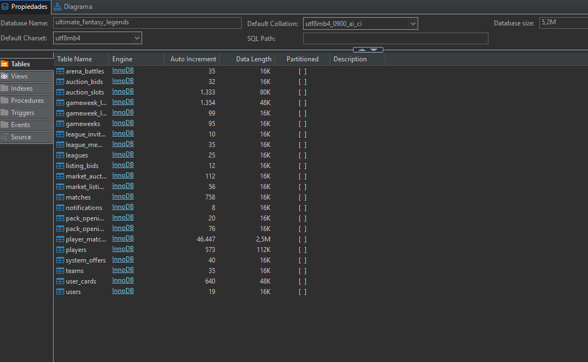
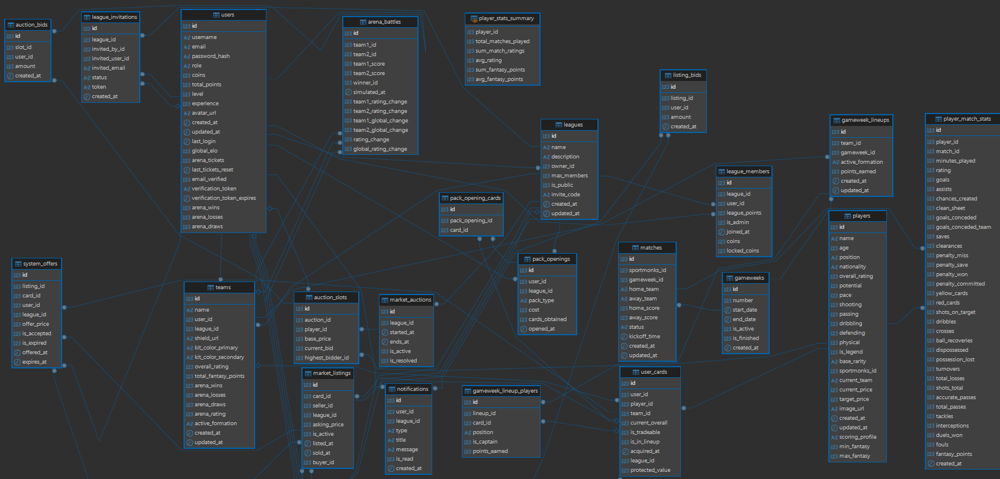


```
User (1) ────────────< Team (N) ──────────< UserCard (N) ──> Player (1)
  │                       │                     │
  │                       │                     └── league_id ──> League (1)
  │                       └── league_id ──> LeagueMember (1)
  │
  ├── Notification (N) ──> League (1)
  └── ArenaBattle (N) (a través de Team)

League (1) ──< MarketAuction (N) ──< AuctionSlot (N) ──> Player (1)
                      │                   │
                      │                   └── AuctionBid (N) ──> User (1)
                      │
                      └── MarketListing (N) ──> UserCard (1)
                                    │
                                    └── ListingBid (N) ──> User (1)

Gameweek (1) ──< Match (N) ──< PlayerMatchStats (N) ──> Player (1)
Gameweek (1) ──< GameweekLineup (N) ──< GameweekLineupPlayer (N) ──> UserCard (1)
Team (1) ──< ArenaBattle (N) (como team1 o team2)
```

### Tablas Principales

| Tabla | Descripción | Campos Clave |
|---|---|---|
| `users` | Usuarios del sistema | `id`, `username`, `email`, `password_hash`, `role`, `global_elo`, `arena_tickets` |
| `players` | Catálogo de jugadores + leyendas | `id`, `name`, `position`, `overall_rating`, `current_price`, `is_legend`, `scoring_profile` |
| `user_cards` | Cartas en posesión de cada usuario | `id`, `user_id`, `player_id`, `team_id`, `current_overall`, `protected_value` |
| `teams` | Equipo de un usuario en una liga | `id`, `user_id`, `league_id`, `name`, `active_formation`, `arena_rating`, `shield_url` |
| `leagues` | Ligas fantasy privadas | `id`, `name`, `owner_id`, `invite_code`, `max_members` |
| `league_members` | Membresía usuario-liga + economía | `id`, `league_id`, `user_id`, `league_points`, `coins`, `locked_coins` |
| `market_auctions` | Subastas diarias por liga | `id`, `league_id`, `started_at`, `ends_at`, `is_active`, `is_resolved` |
| `auction_slots` | Jugadores individuales en subasta | `id`, `auction_id`, `player_id`, `base_price`, `current_bid`, `highest_bidder_id` |
| `market_listings` | Ventas entre usuarios | `id`, `card_id`, `seller_id`, `asking_price`, `is_active`, `buyer_id` |
| `gameweeks` | Jornadas de la liga real | `id`, `number`, `start_date`, `end_date`, `is_active`, `is_finished` |
| `gameweek_lineups` | Snapshots de alineaciones por jornada | `id`, `team_id`, `gameweek_id`, `active_formation`, `points_earned` |
| `matches` | Partidos reales de la SPFL | `id`, `sportmonks_id`, `home_team`, `away_team`, `home_score`, `status` |
| `player_match_stats` | Stats de cada jugador en cada partido | `id`, `player_id`, `match_id`, `goals`, `assists`, `minutes_played`, `fantasy_points` + 20 campos |
| `arena_battles` | Historial de batallas PvP | `id`, `team1_id`, `team2_id`, `winner_id`, `rating_change`, `global_rating_change` |
| `notifications` | Alertas del sistema por liga | `id`, `user_id`, `league_id`, `type`, `title`, `message`, `is_read` |
| `system_offers` | Ofertas automáticas del sistema | `id`, `listing_id`, `offer_price`, `is_accepted` |

> 📷 *Ver imagen del diagrama ER completo en `screenshots/diagrama.png`*

---

## 🎯 Motor de Puntuación

### Filosofía de Diseño

> **Las acciones decisivas** (goles y asistencias) son las más valiosas. Las acumulativas (pases, tackles) aportan bonus secundarios. La paridad económica es `1 punto = 100.000 monedas`.

### Tabla Completa de Puntuación

#### ⚽ Acciones Decisivas

| Acción | 🧤 Portero | 🔵 Defensa | 🟢 Medio | ⚽ Delantero | Racional |
|---|:---:|:---:|:---:|:---:|---|
| **Gol** | +10 | +6 | +5 | +4 | Premia la rareza: un gol de portero es excepcional |
| **Asistencia** | +6 | +4 | +3 | +3 | Asistencia de portero/defensa = más valiosa por inesperada |
| **Ocasión creada** | +2 | +2 | +2 | +2 | Pase clave que genera oportunidad clara de gol |

#### ⏱️ Acciones de Tiempo (todos)

| Acción | Puntos |
|---|:---:|
| Minuto jugado | +1 |
| 60+ minutos jugados | +2 adicionales |

#### 🛡️ Acciones Defensivas

| Acción | 🧤 Portero | 🔵 Defensa |
|---|:---:|:---:|
| Portería a cero | +5 | +4 |
| Gol recibido | -3 | -3 |
| Salvamento | +1 | — |
| Tackles (cada 8) | +1 | +1 |
| Intercepciones (cada 8) | +1 | +1 |
| Despejes (cada 6) | +1 | +1 |
| Recuperaciones (cada 10) | +1 | +1 |

#### 🏃 Acciones Ofensivas (todos)

| Acción | Puntos |
|---|:---:|
| Tiros a puerta (cada 4) | +1 |
| Regates logrados (cada 5) | +1 |
| Balones al área (cada 4) | +1 |
| Pases precisos (cada 50) | +1 |
| Duelos ganados (cada 10) | +1 |

#### ⚠️ Penalizaciones (todos)

| Acción | Puntos |
|---|:---:|
| Tarjeta amarilla | -1 |
| Tarjeta roja | -3 |
| Penalti fallado | -2 |
| Penalti cometido | -2 |
| Penalti recibido | +1 |
| Penalti parado (solo GK) | +5 |
| Faltas cometidas (cada 2) | -1 |

#### ⭐ Bonus por Rating de Partido

| Rating | Puntos Bonus |
|---|:---:|
| 8.0 – 8.9 | +2 |
| 9.0 – 9.9 | +3 |
| 10.0 | +4 |

### 🌟 Ejemplo de Cálculo Real

> **Kyogo Furuhashi** — Celtic FC — Delantero — Celtic 2–1 Rangers

| Acción | Cálculo | Puntos |
|---|---|---|
| Minutos jugados (85 min) | Jugado + 60+ min | +3 |
| 2 goles como delantero | 2 × 4 pts | +8 |
| 1 asistencia | 3 pts | +3 |
| **Total** | | **14 pts = 1.400.000 monedas** |

---

## 💰 Ingeniería Económica

### Economía Independiente por Liga

Cada liga gestiona su **propia economía de forma aislada**. Esto significa que un usuario puede tener **100M de monedas en una liga** y **50M en otra**, sin que se mezclen. Las monedas, las pujas bloqueadas y las transacciones son específicas de cada liga:

| Concepto | Valor | Descripción |
|---|---|---|
| Saldo inicial | **100.000.000 monedas** | Presupuesto de partida para operar en el mercado |
| Ingreso por jornada | `puntos_totales × 100.000` | Los puntos de los 11 titulares se convierten en monedas |
| Monedas bloqueadas (`locked_coins`) | Dinero pujado en subastas activas | No se puede usar mientras la puja esté pendiente |
| Monedas libres | `coins − locked_coins` | Saldo disponible para nuevas pujas o compras |

### Fuentes de Ingresos

Un usuario puede obtener monedas de **cuatro fuentes principales**:

1. **Puntos de jornada** (fuente principal): Cada punto fantasy obtenido por los 11 titulares se convierte en 100.000 monedas. Una jornada de 50 puntos = 5.000.000 de monedas.
2. **Arena PvP**: Cada victoria otorga un bonus variable (hasta 500K). Ganar los 5 combates diarios puede suponer hasta 2.5M.
3. **Ventas de jugadores**: Vender una carta propia a otro usuario genera ingresos directos al saldo del vendedor.
4. **Liberar jugadores**: Un usuario puede liberar (eliminar) un jugador de su equipo y recuperar el **50% de su valor de mercado** en monedas.

### Ciclo del Mercado

```
┌───────────────────────────────────────────────┐
│         NUEVA SUBASTA (cada 24h por liga)     │
│         12 jugadores aleatorios del catálogo  │
│         Precios estables (no fluctúan)        │
└────────────────────┬──────────────────────────┘
                     │
            Usuarios pujan en ciego
            Monedas → locked_coins (retiradas del saldo)
                     │
                     ▼
┌───────────────────────────────────────────────┐
│         CIERRE AUTOMÁTICO (scheduler)         │
│  Cada 5 minutos verifica subastas expiradas   │
│                                               │
│  Ganador: mayor puja → carta asignada         │
│  Perdedores: monedas desbloqueadas (vuelven)  │
└────────────────────┬──────────────────────────┘
                     │
                     ▼
┌───────────────────────────────────────────────┐
│     NUEVA SUBASTA GENERADA AUTOMÁTICAMENTE    │
│     Otros 12 jugadores aleatorios             │
└───────────────────────────────────────────────┘
```

### 🔒 Transacciones Atómicas (ACID)

Todas las operaciones económicas son **transacciones SQL atómicas** con rollback completo si algo falla. Esto garantiza que el dinero **nunca desaparece ni se duplica**, incluso en caso de error del servidor:

```sql
INICIO TRANSACCIÓN
  1. Verificar fondos suficientes del comprador
  2. Restar monedas al comprador (o desbloquear si era puja)
  3. Sumar monedas al vendedor
  4. Cambiar owner de la UserCard (player_id → nuevo team_id)
  5. Actualizar el saldo de ambos en league_members
SI TODO OK → COMMIT      ← Los cambios se hacen permanentes
SI ALGO FALLA → ROLLBACK ← Se deshace todo como si nunca ocurrió
```

Esta garantía es esencial en un juego con economía virtual: un bug que duplicara monedas o las hiciera desaparecer rompería la confianza de los usuarios y la integridad competitiva de la liga.

### 🔧 Reconciliación Económica Automática

El scheduler ejecuta periódicamente una tarea de **reconciliación económica** que verifica que los `locked_coins` de cada usuario coincidan con sus pujas activas reales. Si detecta una discrepancia (por ejemplo, un usuario tiene 5M bloqueados pero solo ha pujado 3M), corrige automáticamente el saldo. Esto previene inconsistencias causadas por errores de red o race conditions durante las pujas.

---

## ⚔️ Arena PvP

### ¿Qué es la Arena?

La Arena es el modo de competición individual que trasciende las ligas. Mientras que las ligas enfrentan a usuarios dentro de un grupo cerrado, la Arena permite que **cualquier usuario de la plataforma** se enfrente a cualquier otro, independientemente de la liga en la que participe. Esto crea un **ranking ELO global** que refleja el nivel real de cada manager.

### Algoritmo de Simulación

La Arena no usa datos de partidos reales. En su lugar, simula un enfrentamiento comparando las líneas de ambos equipos:

```
1. Selección de rival  →  ELO similar (±200 puntos del rating del usuario)
          │
2. Comparación por líneas (OVR medio de los jugadores en cada posición):
          │
          ├── Ataque vs Defensa
          │   · El ataque del equipo A se enfrenta a la defensa del equipo B
          │   · El ataque del equipo B se enfrenta a la defensa del equipo A
          │   · Si ataque > defensa → ventaja ofensiva (+1 gol base)
          │
          ├── Mediocampo vs Mediocampo
          │   · El equipo con mayor OVR en mediocampo obtiene un bonus de posesión
          │   · La posesión otorga +0.5 goles base al equipo dominante
          │
          └── Portero vs Portero
              · El portero con mayor OVR tiene bonus de parada
              · Reduce los goles recibidos en 0.5
          │
3. Multiplicadores por sinergias (bonificación sobre el OVR total):
          │
          ├── Sinergias por club      → +2% por cada par de jugadores del mismo club
          └── Sinergias por nación    → +1% por cada par de jugadores de la misma nación
          │
          · Ejemplo: si tu equipo tiene 3 jugadores del Celtic → 3 pares → +6%
          · Ejemplo: si tienes 2 jugadores escoceses + 2 ingleses → 2 pares → +2%
          │
4. Marcador simulado + factor aleatorio (±15%):
          │
          · El marcador base se modifica con un multiplicador aleatorio entre 0.85 y 1.15
          · Esto introduce incertidumbre: un equipo ligeramente inferior puede ganar
          · Simula la imprevisibilidad real del fútbol
          │
5. Cálculo ELO con fórmula estándar (K = 32):
          │
          Expected_A = 1 / (1 + 10^((Rating_B - Rating_A) / 400))
          Victoria: New_Rating = Rating + 32 × (1 − Expected)
          Derrota:  New_Rating = Rating + 32 × (0 − Expected)
```

### ¿Por qué ELO y no puntos?

El sistema ELO (usado en ajedrez y videojuegos competitivos) es más justo que un ranking por puntos porque **tiene en cuenta el nivel del rival**:
- Ganar a un rival con ELO alto da **más puntos** que ganar a uno con ELO bajo.
- Perder contra un rival débil penaliza **más** que perder contra uno fuerte.
- Esto evita que usuarios con muchos combates contra rivales débiles escalen artificialmente.

### 🎟️ Sistema de Tickets

| Concepto | Valor |
|---|---|
| Tickets por día | **5** |
| Reset diario | Medianoche (automático por scheduler) |
| Coste por combate | 1 ticket |
| Coste en monedas | Gratuito (solo consume ticket) |
| Tickets no usados | No se acumulan; se pierden al resetear |

### 🏅 Recompensas

| Resultado | ELO | Monedas | Registro |
|---|---|---|---|
| Victoria | ↑ (varía según diferencia de rating) | Bonus variable (hasta 500K por victoria) | +1 win |
| Empate | ± mínimo | Pequeño bonus (100K) | +1 draw |
| Derrota | ↓ (varía) | — | +1 loss |

> Las recompensas de monedas de la Arena se envían automáticamente a **la liga del usuario** para usarlas en el mercado. Ganar 5 combates en un día puede suponer hasta **2.5 millones de monedas** extra.

---

## 📁 Estructura del Proyecto

```
ProyectoFinCurso/
│
├── 📄 README.md                        ← Este archivo
├── 🐳 docker-compose.yml               ← Orquestación Docker (3 servicios)
├── 🔐 .env                             ← Variables de entorno (no subir a git)
├── 🗄️  ultimate_fantasy_legends.sql    ← Schema MySQL + datos iniciales (1000+ jugadores)
│
├── backend/                            ← FastAPI + Python
│   ├── 🐳 Dockerfile
│   ├── 📋 requirements.txt
│   └── app/
│       ├── ⚙️  main.py                 ← Entry point: FastAPI app, CORS, startup
│       ├── core/
│       │   ├── config.py               ← Variables de entorno (Pydantic Settings)
│       │   ├── database.py             ← Engine SQLAlchemy, sesión, get_db
│       │   └── scheduler.py            ← APScheduler: tareas programadas
│       ├── models/
│       │   └── models.py               ← Todos los modelos ORM (959 líneas)
│       ├── schemas/                    ← Schemas Pydantic (validación request/response)
│       ├── routers/
│       │   ├── auth.py                 ← /register, /login, /verify-email, /me
│       │   ├── leagues.py              ← CRUD ligas, invitaciones, membresía
│       │   ├── teams.py                ← Equipos, alineaciones, puntos por jornada
│       │   ├── players.py              ← Catálogo de jugadores, cartas del usuario
│       │   ├── market.py              ← Subastas, pujas, clausulazos, blindajes
│       │   ├── arena.py                ← Simulación PvP, historial, leaderboard
│       │   ├── packs.py                ← Apertura de sobres de iconos
│       │   ├── admin.py                ← Panel admin: CRUD global, economía
│       │   └── notifications.py        ← CRUD notificaciones
│       └── services/
│           ├── auth_service.py         ← OTP, tokens JWT, hash de contraseñas
│           ├── scoring_calculator.py   ← Puntos fantasy desde PlayerMatchStats
│           └── sportmonks_client.py    ← Cliente HTTP para Sportmonks API
│
└── frontend/                           ← React 18 + Vite
    ├── 🐳 Dockerfile
    ├── vite.config.js                  ← Proxy /api → localhost:8000
    └── src/
        ├── App.jsx                     ← Router principal (15+ rutas)
        ├── context/
        │   └── AuthContext.jsx         ← Auth global: user, login, logout, leagueId
        ├── services/
        │   ├── api.js                  ← Axios: baseURL, interceptores JWT
        │   └── endpoints.js            ← Funciones de API por módulo
        ├── components/
        │   ├── FormationPitch.jsx      ← Campo táctico visual interactivo
        │   ├── PlayerDetailModal.jsx   ← Modal: stats, clausulazo, blindaje, venta
        │   ├── PackOpeningModal.jsx    ← Animación de apertura de sobres
        │   ├── TeamCustomizerModal.jsx ← Nombre, escudo y colores del equipo
        │   └── WelcomeTeamModal.jsx    ← Modal de bienvenida con los 15 jugadores
        └── pages/
            ├── LoginPage.jsx           ← Login con panel de marca
            ├── RegisterPage.jsx        ← Registro con validaciones
            ├── Dashboard.jsx           ← Inicio post-login: resumen y accesos rápidos
            ├── LeagueDetailPage.jsx    ← Clasificación, mercado, sobres
            ├── TeamManagementPage.jsx  ← Pitch interactivo, formaciones, banquillo
            ├── ArenaPage.jsx           ← PvP: selección, combate animado, historial
            ├── ProfilePage.jsx         ← Perfil: info, ligas, invitaciones
            └── AdminDashboard.jsx      ← Panel admin: stats, CRUD, economía
```

---

## 📡 API Reference

> 📖 Documentación interactiva disponible en **`http://localhost:8000/docs`** (Swagger UI).

### 🔑 Autenticación — `/api/auth`

| Método | Endpoint | Descripción |
|---|---|---|
| `POST` | `/api/auth/register` | Crea usuario y envía OTP por email |
| `POST` | `/api/auth/login` | Autentica y devuelve JWT |
| `GET` | `/api/auth/me` | Perfil del usuario autenticado |
| `POST` | `/api/auth/verify-email` | Verifica email con OTP de 6 dígitos |
| `POST` | `/api/auth/resend-verification` | Reenvía el código OTP |
| `GET` | `/api/auth/search` | Busca usuarios por username |
| `PUT` | `/api/auth/profile` | Actualiza username o avatar |

### 🏆 Ligas — `/api/leagues`

| Método | Endpoint | Descripción |
|---|---|---|
| `POST` | `/api/leagues/` | Crea nueva liga + asigna 15 jugadores iniciales |
| `GET` | `/api/leagues/` | Lista ligas del usuario |
| `GET` | `/api/leagues/{id}` | Detalle completo con miembros y stats |
| `POST` | `/api/leagues/join/{code}` | Unirse por código de invitación |
| `POST` | `/api/leagues/{id}/invite` | Invitar por username o email |
| `DELETE` | `/api/leagues/{id}/leave` | Abandonar liga |
| `DELETE` | `/api/leagues/{id}/kick/{userId}` | Expulsar miembro (admin/propietario) |
| `GET` | `/api/leagues/invitations/pending` | Ver invitaciones pendientes |
| `POST` | `/api/leagues/invitations/{id}/accept` | Aceptar invitación |
| `POST` | `/api/leagues/invitations/{id}/reject` | Rechazar invitación |

### ⚽ Equipos — `/api/teams`

| Método | Endpoint | Descripción |
|---|---|---|
| `GET` | `/api/teams/my` | Mis equipos (todos o filtrado por liga) |
| `GET` | `/api/teams/{leagueId}/user/{userId}` | Equipo de otro usuario (solo lectura) |
| `PUT` | `/api/teams/my` | Actualizar nombre, formación, escudo, colores |
| `PUT` | `/api/teams/my/lineup` | Establecer 11 titulares |
| `POST` | `/api/teams/my/release/{cardId}` | Liberar jugador (recupera 50% del valor) |
| `GET` | `/api/teams/active-gameweek` | Jornada activa actual |
| `GET` | `/api/teams/my/gameweek-points` | Puntos por jornada de mi equipo |

### 💸 Mercado — `/api/market`

| Método | Endpoint | Descripción |
|---|---|---|
| `GET` | `/api/market/{leagueId}/auction` | Subasta activa con slots y mis pujas |
| `POST` | `/api/market/{leagueId}/bid/{slotId}` | Pujar en un slot |
| `DELETE` | `/api/market/{leagueId}/bid/{slotId}` | Retirar puja |
| `GET` | `/api/market/{leagueId}/listings` | Listados de venta activos |
| `POST` | `/api/market/{leagueId}/list/{cardId}` | Publicar carta en venta |
| `POST` | `/api/market/{leagueId}/clause/{cardId}` | Clausulazo: comprar jugador rival |
| `POST` | `/api/market/{leagueId}/protect/{cardId}` | Blindar jugador |
| `GET` | `/api/market/global-trends` | Jugadores más fichados |

### ⚔️ Arena PvP — `/api/arena`

| Método | Endpoint | Descripción |
|---|---|---|
| `GET` | `/api/arena/status` | ELO, tickets, wins/losses del usuario |
| `POST` | `/api/arena/simulate` | Simular combate con rival aleatorio |
| `GET` | `/api/arena/history` | Historial de batallas |
| `GET` | `/api/arena/leaderboard` | Ranking global (Top 50) |

### 📦 Sobres — `/api/packs`

| Método | Endpoint | Descripción |
|---|---|---|
| `POST` | `/api/packs/open` | Abrir sobre de iconos |
| `GET` | `/api/packs/history` | Historial de sobres abiertos |

### 🔔 Notificaciones — `/api/notifications`

| Método | Endpoint | Descripción |
|---|---|---|
| `GET` | `/api/notifications/` | Notificaciones filtradas por liga |
| `GET` | `/api/notifications/unread-count` | Contador de no leídas |
| `POST` | `/api/notifications/{id}/read` | Marcar como leída |
| `POST` | `/api/notifications/read-all` | Marcar todas como leídas |
| `DELETE` | `/api/notifications/clear-all` | Borrar todas de una liga |

### 🔑 Admin — `/api/admin` *(requiere rol `admin`)*

| Método | Endpoint | Descripción |
|---|---|---|
| `GET` | `/api/admin/stats` | Estadísticas globales del sistema |
| `GET` | `/api/admin/users` | Listar usuarios (con búsqueda) |
| `DELETE` | `/api/admin/users/{userId}` | Eliminar usuario y todos sus datos |
| `GET` | `/api/admin/leagues` | Listar ligas |
| `GET` | `/api/admin/players` | Listar jugadores con filtros avanzados |
| `PUT` | `/api/admin/players/{playerId}` | Editar jugador completo |
| `PUT` | `/api/admin/users/{userId}/league-coins` | Ajustar monedas de usuario |

---

## 🚀 Instalación y Despliegue

### ✅ Prerrequisitos

```bash
docker --version        # Docker 20.x+
docker compose version  # Docker Compose v2.x+
```

### 🐳 Despliegue con Docker (Recomendado)

**1. Obtener el código**

```bash
git clone <url-del-repo>
cd ProyectoFinCurso
```

**2. Configurar variables de entorno**

Edita el archivo `.env` en la raíz del proyecto:

```env
# Base de datos
MYSQL_ROOT_PASSWORD=tu_password_mysql_aqui
MYSQL_DATABASE=ultimate_fantasy_legends

# API externa
SPORTMONKS_API_KEY=tu_api_key_aqui

# Seguridad (generar con: python -c "import secrets; print(secrets.token_hex(32))")
SECRET_KEY=tu_clave_secreta_aqui

# Frontend (CORS)
FRONTEND_URL=http://localhost:3000

# Email (verificación OTP)
SMTP_HOST=smtp.gmail.com
SMTP_PORT=587
SMTP_USER=tu_email@gmail.com
SMTP_PASSWORD=tu_app_password_de_gmail

# Desarrollo
BYPASS_EMAIL_VERIFICATION=false
```

> 💡 Para obtener un App Password de Gmail: Cuenta de Google → Seguridad → Verificación en 2 pasos → Contraseñas de aplicaciones.

**3. Levantar los servicios**

```bash
docker compose up -d --build
```

Este comando construye las imágenes, descarga MySQL 8.0, inicia los 3 contenedores en orden y ejecuta `ultimate_fantasy_legends.sql` con todas las tablas y datos iniciales.

**4. Verificar el estado**

```bash
docker compose ps
# Debes ver 3 contenedores con status "Up"

docker compose logs backend
# Debe mostrar:
# ✅ Tablas verificadas/creadas correctamente
# 📅 Scheduler iniciado correctamente
```

**5. Acceder a la aplicación**

| Servicio | URL |
|---|---|
| 🌐 Frontend | [http://localhost:3000](http://localhost:3000) |
| ⚙️ Backend API | [http://localhost:8000](http://localhost:8000) |
| 📖 Swagger UI | [http://localhost:8000/docs](http://localhost:8000/docs) |

---

### 💻 Desarrollo Local (sin Docker)

**Backend:**

```bash
cd backend
python -m venv venv
source venv/bin/activate       # Linux/Mac
venv\Scripts\activate          # Windows

pip install -r requirements.txt

# Crear BD e importar schema
mysql -u root -p -e "CREATE DATABASE ultimate_fantasy_legends;"
mysql -u root -p ultimate_fantasy_legends < ../ultimate_fantasy_legends.sql

uvicorn app.main:app --reload
# Disponible en http://localhost:8000
```

**Frontend:**

```bash
cd frontend
npm install
npm run dev
# Disponible en http://localhost:5173
# El proxy de Vite redirige /api → localhost:8000 automáticamente
```

---

### 🔧 Variables de Entorno — Referencia Completa

| Variable | Descripción | Obligatorio |
|---|---|:---:|
| `MYSQL_ROOT_PASSWORD` | Contraseña root de MySQL | ✅ |
| `MYSQL_DATABASE` | Nombre de la base de datos | ✅ |
| `SPORTMONKS_API_KEY` | API key para datos reales de la SPFL | ✅ |
| `SECRET_KEY` | Clave para firmar JWTs | ✅ |
| `FRONTEND_URL` | URL del frontend (CORS) | ❌ |
| `SMTP_HOST` | Servidor SMTP | ❌ |
| `SMTP_PORT` | Puerto SMTP | ❌ |
| `SMTP_USER` | Cuenta de email | ❌ |
| `SMTP_PASSWORD` | App password del email | ❌ |
| `BYPASS_EMAIL_VERIFICATION` | Saltar verificación OTP en dev | ❌ |

---

### 🛠️ Solución de Problemas

<details>
<summary><b>MySQL no arranca</b></summary>

```bash
docker compose logs db
# Si dice "Port already in use" → otro servicio usa el 3306
# Solución: detén el MySQL local o cambia el puerto en docker-compose.yml
```
</details>

<details>
<summary><b>Backend no conecta a la BD</b></summary>

```bash
docker exec -it football-fantasy-db mysql -u root -ptu_password -e "SHOW DATABASES;"
```
</details>

<details>
<summary><b>La BD no tiene datos</b></summary>

```bash
docker exec -i football-fantasy-db mysql -u root -ptu_password ultimate_fantasy_legends < ultimate_fantasy_legends.sql
```
</details>

---

## 🧪 Cuentas de Prueba

> Válidas únicamente en entornos de desarrollo local.

| Email | Contraseña | Rol | Acceso |
|---|---|---|---|
| `admin@admin.com` | `123456` | `ADMIN` | Panel de administración, edición de jugadores, ajuste de economía |
| `user@user.com` | `123456` | `FREE` | Flujo completo: ligas, mercado, Arena PvP |

---

## 🖼️ Capturas de Pantalla

| Login | Registro | Dashboard |
|:---:|:---:|:---:|
| 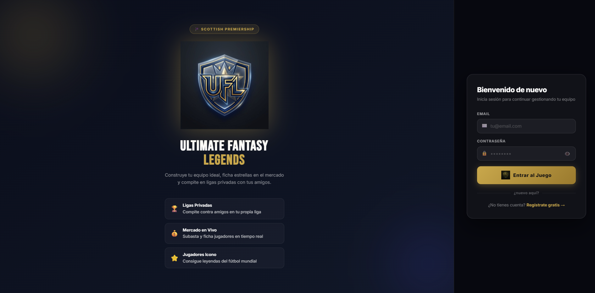 | 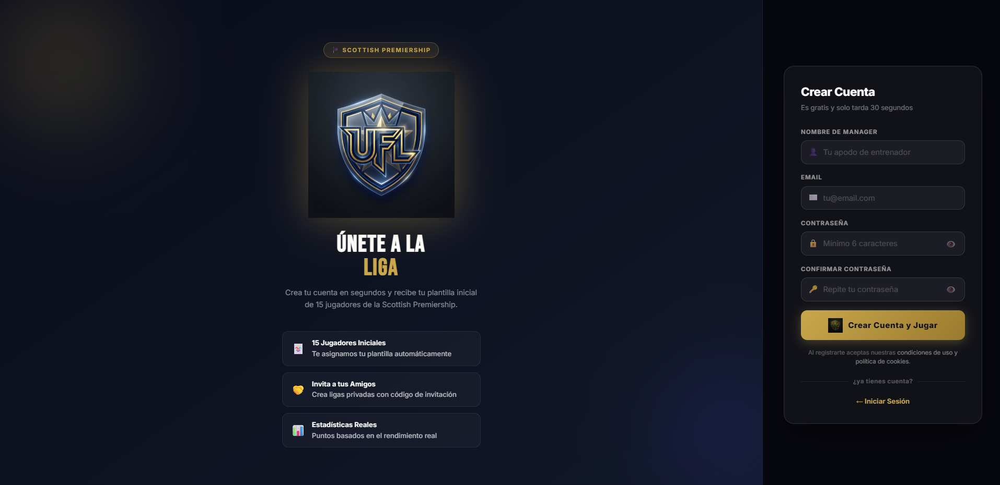 | 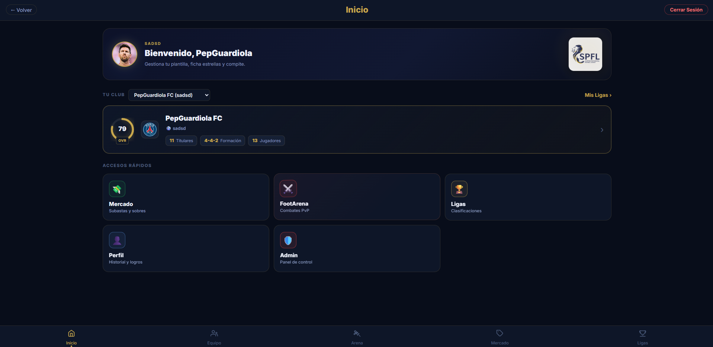 |

| Gestión de Equipo | Mercado | Arena PvP |
|:---:|:---:|:---:|
| 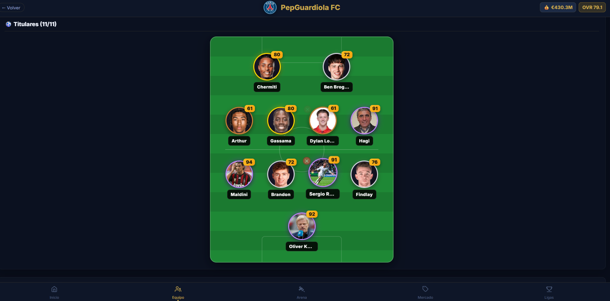 | 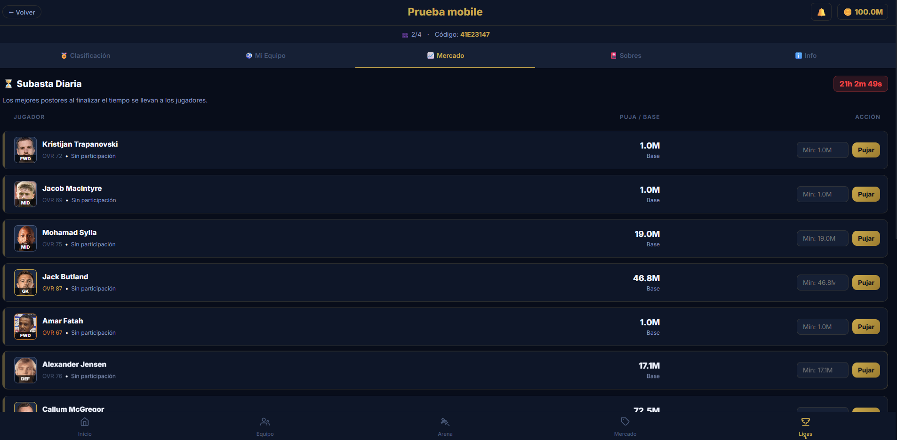 | 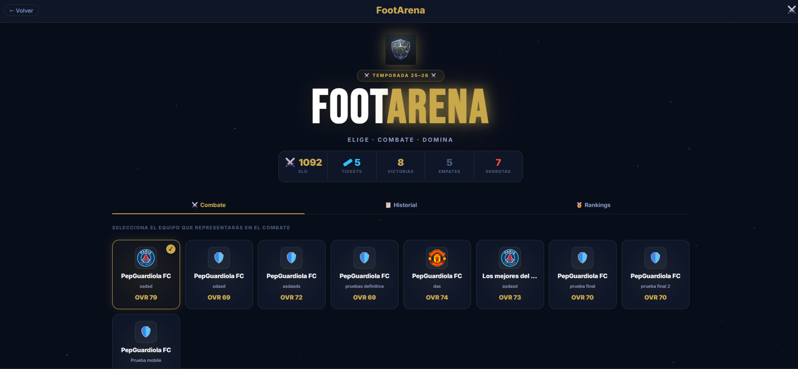 |

| Detalle de Jugador | Ligas | Perfil |
|:---:|:---:|:---:|
| 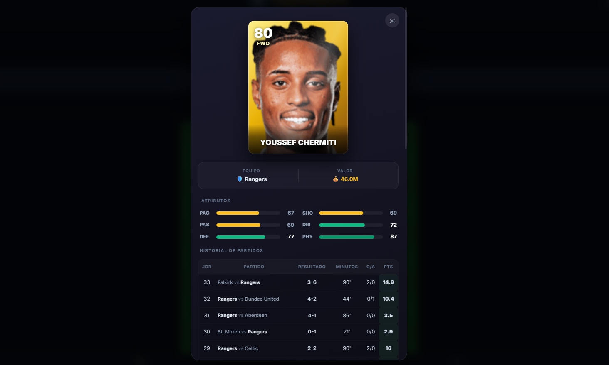 | 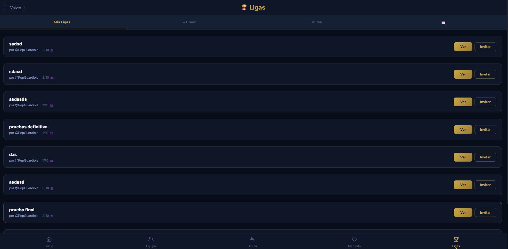 | 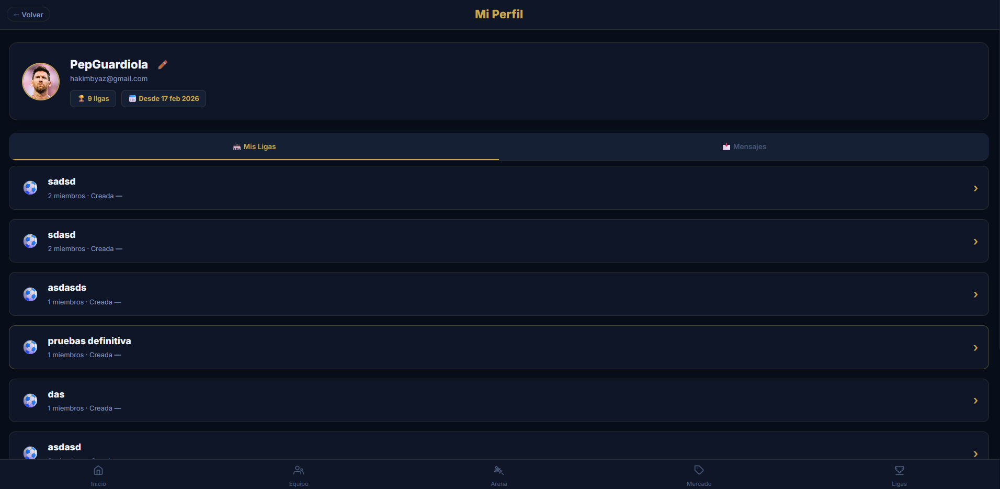 |

| Panel Admin | Notificaciones | Sobres |
|:---:|:---:|:---:|
| 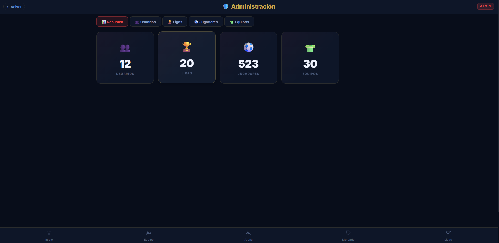 | 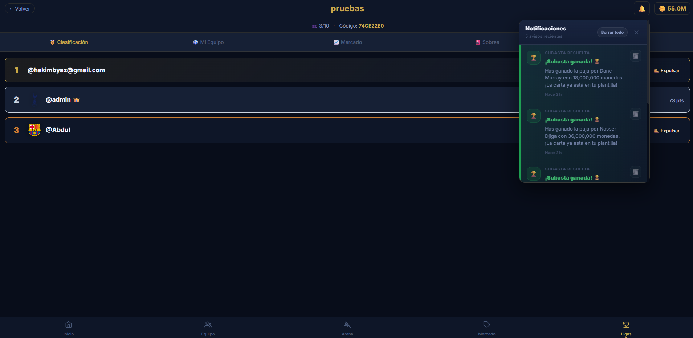 | 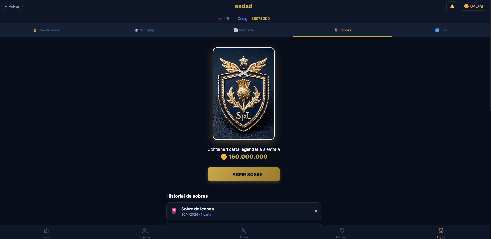 |

| Ofertas del Sistema | | |
|:---:|:---:|:---:|
| 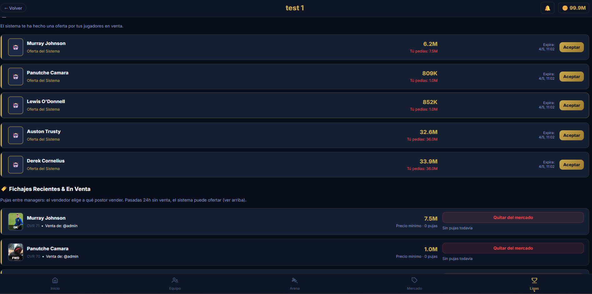 | | |


---

## 🤝 Guía de Contribución

### Flujo de Ramas

```
main                    ← Código estable listo para producción
  │
  ├── feature/xxx       ← Nueva funcionalidad
  ├── fix/xxx           ← Corrección de bug
  ├── refactor/xxx      ← Mejora sin cambio funcional
  └── docs/xxx          ← Documentación
```

### Convenciones de Commits

| Prefijo | Uso | Ejemplo |
|---|---|---|
| `feat:` | Nueva funcionalidad | `feat: añadir notificaciones push` |
| `fix:` | Corrección de bug | `fix: corregir cálculo de locked_coins` |
| `refactor:` | Mejora sin cambio funcional | `refactor: extraer scoring a servicio` |
| `docs:` | Documentación | `docs: actualizar endpoints de Arena` |
| `style:` | Cambios visuales | `style: mejorar contraste del marketplace` |
| `test:` | Tests | `test: añadir tests al scoring calculator` |
| `perf:` | Rendimiento | `perf: optimizar query de subastas` |
| `chore:` | Mantenimiento | `chore: actualizar FastAPI a 0.104.1` |

### Estilo de Código

**Backend (Python):** PEP 8 · 4 espacios · type hints obligatorios en funciones públicas · docstrings en routers y servicios · `snake_case` para funciones, `PascalCase` para clases.

**Frontend (React):** componentes funcionales con hooks · `PascalCase` para componentes · usar variables de `variables.css` en lugar de valores hardcodeados · llamadas a la API solo a través de `endpoints.js`.

---

## 🔮 Trabajo Futuro

### ⚡ Corto Plazo (1–3 meses)

| Feature | Descripción | Prioridad |
|---|---|:---:|
| **Notificaciones push** | Web Push API para clausulazos, resultados de subasta y ofertas del sistema en tiempo real | 🔴 Alta |
| **Auditoría de transacciones** | Registro completo de operaciones económicas con saldo anterior/posterior y descripción | 🔴 Alta |
| **WebSockets** | Reemplazar polling del mercado con eventos en tiempo real | 🔴 Alta |
| **Paginación** | offset/limit en leaderboard de Arena y listados de mercado | 🟡 Media |
| **Gráficas de rendimiento** | Líneas de puntos/goles/asistencias por jornada usando Recharts | 🟡 Media |
| **Chat de liga** | Canal de mensajes entre miembros con timestamp y emojis | 🟡 Media |

### 🚧 Medio Plazo (3–6 meses)

| Feature | Descripción | Prioridad |
|---|---|:---:|
| **App móvil nativa** | React Native reutilizando la API actual | 🔴 Alta |
| **Más ligas** | Premier League, La Liga y Serie A en el catálogo | 🔴 Alta |
| **Modo draft** | Selección de jugadores en orden snake (1-2-3-3-2-1) | 🟡 Media |
| **Sistema de logros** | Medallas desbloqueables: primer gol, 10 victorias Arena, millonario… | 🟢 Baja |

### 🌅 Largo Plazo (6+ meses)

| Feature | Descripción | Prioridad |
|---|---|:---:|
| **Eventos Live** | Bonificadores temporales en partidos de alto voltaje (Old Firm) | 🟡 Media |
| **Machine Learning** | Modelo predictivo de rendimiento de jugadores con datos históricos | 🟢 Baja |
| **API pública** | Documentada con rate limiting y API keys para herramientas externas | 🟢 Baja |
| **Internacionalización** | Soporte en inglés, español y francés con i18next | 🟢 Baja |

---

## 📄 Licencia

Este proyecto está desarrollado como parte de un **Trabajo de Fin de Grado** con fines académicos y educativos. El código está disponible para su consulta, estudio y uso educativo.

---

<div align="center">

Desarrollado con ❤️ por **Abdul Hakim Byaz Iglesias**

*Pasión por la tecnología y el fútbol, buscando siempre la excelencia en el diseño de software y la experiencia de usuario.* ⚽

[](https://github.com/Abdul222002)

</div>